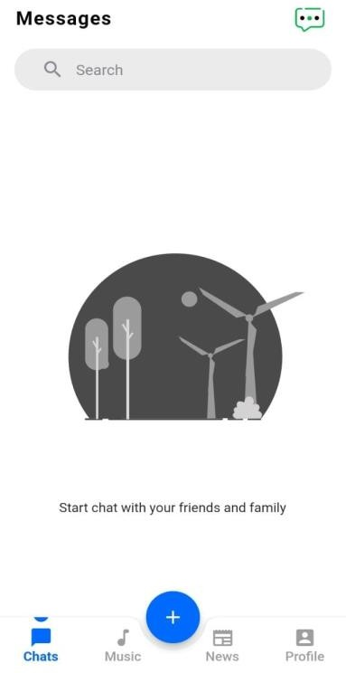
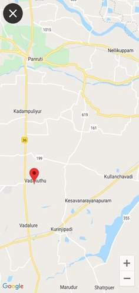

# Jabber (Chatting application)

<a id="raw-url" target="_blank" href="https://doc-08-2o-docs.googleusercontent.com/docs/securesc/v94e5rgqb388mhd08m1tvpn97m6gvq3r/ahp4fl3irvu20gl4evee9oabhuj5hj97/1657103550000/03188896252601356242/03188896252601356242/1NKk02JQcZkKCVzNKhj4ne0mrtt76Am2l?e=download&ax=ACxEAsYtD_cbQfxit3kpfrjckTaNKpofeisfPWgljf3H7680GsyyxHf6Tmd1PmGglmaHPQIyGq6QSnYuwS8Wd2SJnpnuYeSyXp4BGmkgRvfBaIiLtVKijxpjoPI58zlBWm3SKLsneZFQYH7-YnQF3Ur6sSpP8BMmChL0kQKqLaOCBt6LD3Rf_MQ43NUYxste64K0VShmTG1XPryh7n9D0cCoYbog92z4YGMo9_ZdCKugwWWBIjGvwXvrEixnMmPUqNYgomrHpqV4cMCdKGALo-K5JkTYQ2aio-yipj8h6fygaxCT-P1sTUZR-SUYUTCA97mtTcWMniBwQT4TNDPglkEqDKv-DOz_hkZAj-mdVesUU5s2rKj4lha3ay6qY9qe1KEwjD6BWtRO7Hg_dQf2yeMVDGCD0WWzedo1J0xNs67275ZGZ-8W-Og0HZuTZX2n4z_MJowgIPjOBZzkETsglL3o1p1GPXrn9-PaefX4p7Kx_Iee0LHt9OpFKD12zPSj6LQ8QKTqkbVg8l9Hc-TcrXSHXVMn47yNyXgFcMfPy_ZRljR12thHTWfnyxogjHjsu-vy7x4CLOH3L6PDMJSnk55xLOX53MmbIxrW6QheXDHafLF2Er9q1KfMrYrxiLKMEEqkTibwPvwXVz0jBYLRPs8QxRmhS2dB3rJrVzbEMMJpsPuykD3UdyDN7_kp9jJVE2PJixCUx7evPpJxvbVLfS3bgLQ6X7xIgxdZ_HYITCdqQUbB5MI1sV2MaeQ&uuid=f3395212-a263-42e2-9e0c-b0c25e00d15b&authuser=1">Download APK</a>

Chatting application is an flutter app. Chat refers to the process of communicating, interacting and exchanging message over the Internet.  It involves two or more individuals that communicate through a chat-enabled service or software.  Chat may be delivered through text, audio or vide communication via the Internet.
This app runs with any platform such as Linux, windows etc.  It runs on the users android device and server applications.  Which runs on any android device on the network. 
The chat application we are going to make will be more like a chat room, rather than a peer to peer chat.  So this means that multiple users can connect to the chat server and send their messages.  Every message is broadcasted to every connected chat user.

  
  
  
  
  
  
  
  
  
  
  
  
    
  
  
  

